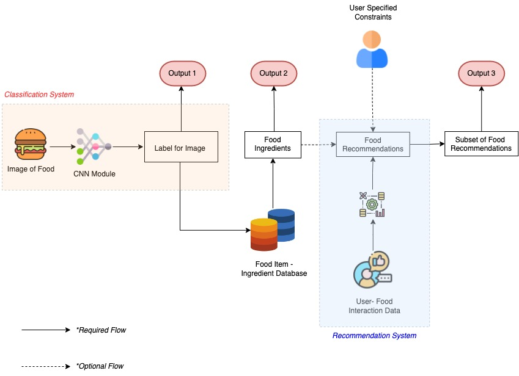

# RoboChef

## Background
Machine Learning systems today aid decision making across the entire spectrum of life. One such decision, that each human has to make daily is his/her "meal choice" . The said decision depends on a multitude of factors like nutritional requirements, eating preferences and mood etc.

In this project, we thus aim to build an ML system that aids multiple aspects of Meal Choice decision using Image Recognition and Recommender Systems.

## Problem Definition
We want to tackle two main problems here:

1. **Given an image of a food item, what are the key ingredients that goes in preparing the food item ?**

2. **What food items should we recommend to a user based on his preferences and other similar users food choices?**
   - Can the recommendation also account for additional constraints from user like nutritional requirements, calories level, etc?

### Usecases
The modular nature of above problems lends itself to multiple usecases:
* When encountered with an unknown food item, the user might want to know its ingredients, such that he can figure out:
    - Is the dish healthy?
    - If the dish contains allergens?

* As a next step, user might want recommendations for similar dishes that he took image of. Additionally, there can be numerous additional constraints placed on the recommendations recieved like:
    - Restrict recommendations to ingredients he already has
    - Constrain by the nutritional requirements of the dish, say the user wants only "low calorie" dishes.

## Methodology
We divide our project pipeline into three main stages:

1. **Classfication System**: This stage would take as input food images and passes them through a CNN to output food labels. The output of this stage is (**Output 1**), and flows to next stage, but can also be used independently.

2. **Food to Ingredient Mapping**: Output 1 from CNN is then queried through a database housing the mapping between food items and their respective ingredients, to yeild **Output 2**. This can again either be used independtly or overlaid over recommendation system as a filter.

3. **Reccomendation System**: In this stage we reccommend the user additional food items: **Output 3** basis his (&other individuals) interactions. We also allow for the user to place additional constraints over the recommendations.

The schematic of these stages is given below:

## Data Collection
### Data for Recommendation system
[Dataset Source](https://www.kaggle.com/datasets/shuyangli94/food-com-recipes-and-user-interactions?select=RAW_recipes.csv)

In this part, we’re using data from the Food.com Recipes and Interactions, which contains 2 datasets: user interactions data and recipe dataset 
   - user interactions dataset: This dataset contains the user Id and users’ interaction with recipes, such as rating and review. 
   - recipe dataset: This dataset contains the recipe information recipe ID, nutrition information, steps to cook, time to cook, etc.

We will join user interactions dataset and recipe dataset based on recipe_id. With the joined data, we’ll use our recommendation system to study user preferences and recommend recipes to users based on their previous behaviors, and optionally input from the ingredient we get from the classification task.

### CNN Module
We will be training the Food-101 dataset using pre-trained CNN architectures like DenseNets and ResNets to classify the image into one of the 101 categories. To evaluate the model performance, we will be using **top-1** and **top-5** classification accuracy on the predictions.

### Recommendation System Module

We will use the user-food interaction data which contains the temporal food-item ratings given by users to provide recommendations for similar food items leveraging the user-user collaborative filtering and matrix factorization techniques.

The matrix factorization method will use the concept of Truncated Singular Value Decomposition to obtain highly predictive latent features using the sparse ratings matrix and provide a fair approximation of predictions of new items ratings.

### Points for further exploration

- Applications of autoencoders to learn underlying feature representation and provide a more personalized recommendation.
- Added functionality to recommend the food items that can be prepared using the ingredients image a user has uploaded.

## Results & Discussion

- In recommendation systems , we have to not only ensure greater accuracy on ratings prediction but also have the most relevant items at the top of the recommendation list i.e. ranking of the recommendations.
  - Evalution metrics to be used : MAP@k(Mean Average Precision at K) and NDCG (Normalized Discounted Cummulative Gain)

## References

<a id="Trang">[1]</a> 
Trang Tran, T.N., Atas, M., Felfernig, A. et al. An overview of recommender systems in the healthy food domain. J Intell Inf Syst 50, 501–526 (2018). https://doi.org/10.1007/s10844-017-0469-0

<a id="2">[2]</a>
Kaggle Data set for User food Interactions
https://www.kaggle.com/datasets/shuyangli94/food-com-recipes-and-user-interactions?select=RAW_recipes.csv

<a id="3">[3]</a> https://www.researchgate.net/publication/340688231_Food_Image_Recognition_Based_on_Densely_Connected_Convolutional_Neural_Networks

## Project Logistics
### Contribution table

| Sr. No. |            Stage Description            |       Contributors               |
|:-------:|:---------------------------------------:|:--------------------------------:|
|    1    |         Classification with CNN         |      Manoj + Anshit + Abhinav    |
|    2    | Querring Label with Ingredient Database |      Yibei + Ashish              |
|    3    |          Recommendation System          |     Abhinav + Ashish + Yibei     |
|    4    |                Deployment               |          Anshit                  |

*Subject to alterations*
### GANTT Chart

[GANTT Chart](https://gtvault-my.sharepoint.com/:x:/g/personal/averma373_gatech_edu/EVhkpnexSZlFo1E8W2ZUiFkBdDpVgO8g5v7mOKs5ekzM0Q?e=DuKFx6)
