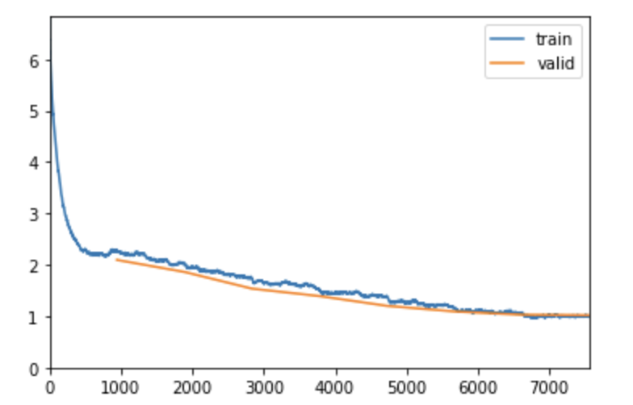

# RoboChef
 [](https://www.python.org/)
[](https://dvc.org/?utm_campaign=badge)

[comment]: <> (TODO)
<!-- TABLE OF CONTENTS -->
<h2 id="table-of-contents"> Table of Contents</h2>

<details open="open">
  <summary>Table of Contents</summary>
  <ol>
    <li><a href="#Background"> ➤ Background</a></li>
    <li><a href="#Problem Definition"> ➤ Problem Definition</a></li>
    <li><a href="#Data Collection"> ➤ Data Collection</a></li>
    <li><a href="#Results & Discussion"> ➤ Results & Discussion</a></li>
    <li><a href="#References"> ➤ References</a></li>
    <li><a href="#Project Logistics"> ➤ Project Logistics</a></li>
  </ol>
</details>


<!-- Background -->
<h2 id="Background"> Background</h2>

Machine Learning systems today aid decision making across the entire spectrum of life. One such decision, that each human has to make daily is his/her "meal choice" . The said decision depends on a multitude of factors like nutritional requirements, eating preferences and mood etc.

In this project, we thus aim to build an ML system that aids multiple aspects of Meal Choice decision using Image Recognition and Recommender Systems.

<!-- Problem Definition -->
<h2 id="Problem Definition"> Problem Definition</h2>

We want to tackle two main problems here:

1. **Given an image of a food item, what are the key ingredients that goes in preparing the food item ?**

2. **What food items should we recommend to a user based on his preferences and other similar users food choices?**
   - Can the recommendation also account for additional constraints from user like nutritional requirements, calories level, etc?


### Usecases
The modular nature of above problems lends itself to multiple usecases:
* When encountered with an unknown food item, the user might want to know its ingredients, such that he can figure out:
    - Is the dish healthy?
    - If the dish contains allergens?

* As a next step, user might want recommendations for similar dishes that he took image of. Additionally, there can be numerous additional constraints placed on the recommendations recieved like:
    - Restrict recommendations to ingredients he already has
    - Constrain by the nutritional requirements of the dish, say the user wants only "low calorie" dishes.


<!-- Project Pipeline -->
<h2 id="Project Pipeline"> Project Pipeline</h2>

We divide our project pipeline into three main stages:

1. **Classfication System**: This stage would take as input food images and passes them through a CNN to output food labels. The output of this stage is (**Output 1**), and flows to next stage, but can also be used independently.

2. **Food to Ingredient Mapping**: Output 1 from CNN is then queried through a database housing the mapping between food items and their respective ingredients, to yield **Output 2**. This can again either be used independently or overlaid over recommendation system as a filter.

3. **Recommendation System**: In this stage we reccommend the user additional food items: **Output 3** basis his (&other individuals) interactions. We also allow for the user to place additional constraints over the recommendations.

The schematic of these stages is given below:


<!-- Data Collection -->
<h2 id="Data Collection"> Data Collection</h2>

### Data for CNN Module
[Dataset Source](https://www.kaggle.com/datasets/dansbecker/food-101)

We will be using Food-101 dataset for the CNN classification which consists of 101 food categories with a total of 101,000 images. 

### Data for Recommendation system
[Dataset Source](https://www.kaggle.com/datasets/shuyangli94/food-com-recipes-and-user-interactions?select=RAW_recipes.csv)

In this part, we’re using data from the Food.com Recipes and Interactions, which contains 2 datasets: user interactions data and recipe dataset 
   - user interactions dataset: This dataset contains the user Id and users’ interaction with recipes, such as rating and review. 
   - recipe dataset: This dataset contains the recipe information recipe ID, nutrition information, steps to cook, time to cook, etc.

We will join user interactions dataset and recipe dataset based on recipe_id. With the joined data, we’ll use our recommendation system to study user preferences and recommend recipes to users based on their previous behaviors, and optionally input from the ingredient we get from the classification task.


<!-- Results & Discussion -->
<h2 id="Results & Discussion"> Results & Discussion</h2>

As defined in the pipeline above, there are three main modules of our ML system, and this section details the results and discussion of the work done until now on each of the items.

### CNN System Module

In this module, we have trained a CNN model to predict the correct food category out of 101 classes using a pretrained resnet34 and resnet50 architecture. We are using **fastai** deep learning library to create the pipeline for the model

#### Exploratory Data Analysis

For each category, we have 750 images in the training set and 250 images in the test set. The training set is further split into 20% validation and 80% training set.

Total Training set: 60600 images <br>
Total Validation set: 15150 images <br>
Total Test set: 25250 images <br>


Scatterplot for the image sizes reveals that images are not of the same size. This can cause irregularities in our training. We will need to transform the images and make the dataset of the same size to maintain conistency while training.

To tackle this problem, all the images have been resized to 224x224 so that each image sample has the same matrix size while training the data.

A sample can be seen below for the dataset.


```python
train_data = ImageDataLoaders.from_df(df=train_df, path=path_images, fn_col=1, label_col=0, valid_pct=0.2, bs=batch_size, item_tfms=Resize(224), device=torch.device('cuda'))
```

Training data has also been augmented with random transformations like crops, rotate, zoom, brightness and contrast to increase the sample size for the CNN models. At the same time, it also helps the model generalize better with more variance in the images.

#### Metrics

We are using Error Rate, Top-1 accuracy and Top-5 accuracy as our metrics to compare between model performances.

Our loss function is cross-entropy.

#### Modeling

##### 1. ResNet34

In the initial model we are leveraging transfer learning and using ResNet34 pre-trained model for classifying food items.

We are keeping the learning rate constant (1e-2) and not using adaptive learning rate. We will also be freezing the weights of the model and not re-training the last layers.


It can be seen that this model takes arond 9 mins to train for each epoch. The training loss and validation loss both seem to go down after each iteration until it almost becomes constant. We stop the model at 8 epochs. We cn also see that the error rate decreased from 0.48 to 0.31 in 8 epochs before plateauing.


The model still does not perform great as it is not able to predict well. We can see the losses for the model in the test dataset.

##### 2. ResNet50

Our second choice of model is again a transfer learning approach with a pre-trained ResNet50 model.

The advantage of ResNet34 vs ResNet50 is that latter uses a stack of 3 layers instead of the earlier 2. Therefore, each of the 2-layer blocks in Resnet34 was replaced with a 3-layer bottleneck block, forming the Resnet 50 architecture. This has much higher accuracy than the 34-layer ResNet model.

We are again keeping the learning rate constant (1e-2) and not using adaptive learning rate. We will also be freezing the weights of the model and not re-training the last layers.


This model takes an average of 13 mins to train as suggested by 16 extra layers in the model. We can observe that the model has achieves a much lower error rate in 8 epochs and we are able to achieve 73% accuracy with Top-5 accuracy of 91%.



As we can see from the graph below for Loss Vs Iterations that we are achieving a constant decrease in loss as the iteration increase and it becomes almost constant at the end.

We can also observe that there is no overfitting and training and validation losses are decreasing simultaneously. It is good to see that fitting to both the real and random patterns very well and able to classify test dataset quite well.


This model performs much better than the previous model and accurately predicts the test dataset as can be seen from the sample.


The model's top losses can be seen here where it predicts with quite high possibility but misclassifies.

#### Further Exploration

1.  Exploring different architectures such as ResNet200 and Efficient Net to train the model and check for increase in accuracy.
2.  Exploring various image augmentation techniques in train and test data both to achieve better and robust results.
3. Based on the most confused matrix and top losses plot images, we could adjust the augmentation hyper-parameters
4. Try training by unfreezing the model weights to train the last few layers and achieving higher accuracy.


### Food Label to Ingredient Mapping

Once we have predicted the label using the above CNN module, we will map this label to our recipe dataset and extract the ingredients list. The ingredient data would feed into the recommendation system and help to give more filtered and personalized recommendations. 

%Therefore, we want to match the labels generated by the CNN model and the names in the recipe table, which contains the dishes' ingredients.

In order to achieve this, we matched all the 101 labels from the Food-101 dataset to the closest recipe name in the recipe database. We used __fuzzwuzzy__ library
which calculates Levenshtein Distance between two strings to report a matching score. For every label, we used the recipe name with the highest matching score.

Below is an example of the results where every label is mapped to a recipe name and its ingredients list from the recipe database.

|          label |           name |     id |                                       ingredients |
|---------------:|---------------:|-------:|--------------------------------------------------:|
|      apple pie |      apple pie | 124853 | [apple juice, raw honey, whole cloves, evercle... |
|      apple pie |      apple pie |  65988 | [all-purpose flour, salt, shortening, cold wat... |
| baby back ribs | baby back ribs | 502407 | [baby back ribs, orange juice, margarita mix, ... |
|        baklava |        baklava |  48804 | [phyllo dough, nuts, butter, ground cinnamon, ... |
| beef carpaccio | beef carpaccio | 189130 | [beef tenderloin, arugula, vinaigrette, kosher... |


To build a coherent pipeline between the CNN and the Recommendation module, we used this preprocessed output to get the ingredients list for the predicted label.
Once, we have the ingredients list, we will use this as filters while recommending new recipes to the user.

Also, we are recommending recipes to a user by picking a user_id at random from the RAW_interactions.csv file.


### Recommendation System Module
We will use the user-food interaction data which contains the temporal food-item ratings given by users to provide recommendations for similar food items leveraging the user-user collaborative filtering and matrix factorization techniques.


#### Exploratory Data Analysis
##### User Recipe Interaction Data
The user interaction recipe data has 5 columns, with head of the table given below:

```bash
Index(['user_id', 'recipe_id', 'date', 'rating', 'review'], dtype='object')
```

| user_id | recipe_id |       date | rating |                                            review |
|--------:|----------:|-----------:|-------:|--------------------------------------------------:|
|   38094 |     40893 | 2003-02-17 |      4 | Great with a salad. Cooked on top of stove for... |
| 1293707 |     40893 | 2011-12-21 |      5 | So simple, so delicious! Great for chilly fall... |
|    8937 |     44394 | 2002-12-01 |      4 |  This worked very well and is EASY. I used not... |
|  126440 |     85009 | 2010-02-27 |      5 | I made the Mexican topping and took it to bunk... |
|   57222 |     85009 | 2011-10-01 |      5 | Made the cheddar bacon topping, adding a sprin... |


The number of unique users and unique recipes is given as:
```
user_id         226570
recipe_id       231637
user_recipe    1132367
```

As expected not every user rates every recipe, which is apparent from the counts above. An estimate of the sparsity of interaction matrix is:
```python
sparsity = 1- (1132367/(N_users*N_Recipes))
print (f"Sparsity in data {sparsity:.9%}")
#Sparsity in data 99.997842371%
```

We have analysed the distribution of these interactions below:

1. How many recipes do the users rate?
```python
user_grp[[("recipe_id","count")]].quantile([0.1,0.2,0.3,0.4,0.5,0.6,0.7,0.8,0.9,1])
```

|      Percentile | 0.1 | 0.2 | 0.3 | 0.4 | 0.5 | 0.6 | 0.7 | 0.8 | 0.9 |    1.0 |
|----------------:|----:|----:|----:|----:|----:|----:|----:|----:|----:|-------:|
| recipe_id,count | 1.0 | 1.0 | 1.0 | 1.0 | 1.0 | 1.0 | 1.0 | 2.0 | 5.0 | 7671.0 |

_Thus almost 90% of the users rate <=5 recipes, to create a heavy left tail skew._

2. How many users rate the same recipes ?
The converse of the above distribution is the distribution of users rating the same recipe.
```python
recipe_grp[[("user_id","count")]].quantile([0.1,0.2,0.3,0.4,0.5,0.6,0.7,0.8,0.9,1])
```

| Percentile    | 0.1 | 0.2 | 0.3 | 0.4 | 0.5 | 0.6 | 0.7 | 0.8 | 0.9 | 1.0    |
|---------------|-----|-----|-----|-----|-----|-----|-----|-----|-----|--------|
| user_id,count | 1.0 | 1.0 | 1.0 | 2.0 | 2.0 | 3.0 | 3.0 | 5.0 | 9.0 | 1613.0 |

_Similar to above we see a highly skewed distribution, with 80% of the recipes being rated by <=5 users_

3. Distribution of Ratings?
```python
raw_interactions["rating"].hist()
```


_The ratings follow a heavy skew, with 4 and 5 being the predominant rating_


##### Recipe Metadata
The recipe data has 12 columns and 231636 rows, which gives us 231636 unique recipes with 12 features.

```bash
Index(['name', 'id', 'minutes', 'contributor_id', 'submitted', 'tags',
       'nutrition', 'n_steps', 'steps', 'description', 'ingredients',
       'n_ingredients'],
      dtype='object')
```
Among the 231636 recipes, there is only one data point that is a missing value. The data point doesn't have attribute name. Therefore, we delete this datapoint.

After analyzing the quantitative data, we found that the mean steps of cooking is around 9.5 steps; mean cooking time is about 9 mins, and mean number of ingredient is around 9. Also, there is positive relations between steps and ingredients.

The distribution of few features in metadata is given below:

|       | minutes      | n_steps       | n_ingredients |
|-------|--------------|---------------|---------------|
| count | 2.316360e+05 | 231636.000000 | 231636.000000 |
| mean  | 9.398587e+03 | 9.765516      | 9.051149      |
| std   | 4.461973e+06 | 5.995136      | 3.734803      |
| min   | 0.000000e+00 | 0.000000      | 1.000000      |
| 25%   | 2.000000e+01 | 6.000000      | 6.000000      |
| 50%   | 4.000000e+01 | 9.000000      | 9.000000      |
| 75%   | 6.500000e+01 | 12.000000     | 11.000000     |
| max   | 2.147484e+09 | 145.000000    | 43.000000     |

The n_ingredient data is skew to the right, however, the mode of n_ingredients is also around 9 and 10.


The correlation between few important metadata features are given below:

|               | minutes   | n_steps   | n_ingredients |
|---------------|-----------|-----------|---------------|
| minutes       | 1.000000  | -0.000257 | -0.000592     |
| n_steps       | -0.000257 | 1.000000  | 0.427706      |
| n_ingredients | -0.000592 | 0.427706  | 1.000000      |

Also the minutes column has a lot of very high noisey values, so we have capped the variable to 48*60 or (48 hrs * 60 minutes).

#### Hypothesis Testing
The metadata above lends to few intuitive hypotheses, like are more complex dishes rated lower? We have performed Hypothesis testing for this, and this helps us to tune our models.

Effect of Minutes required to cook on the rating of the dish
We have bucketed the cleaned minutes variable into meaningful buckets, which is then used to analyse the effect on other variables.

| minutes_buckets | n_ingredients | n_steps   | rating   |
|-----------------|---------------|-----------|----------|
| a.<=15          | 6.503086      | 5.737489  | 4.469096 |
| b.<=30          | 8.597985      | 8.877021  | 4.427940 |
| c.<=60          | 9.607273      | 10.610071 | 4.405543 |
| d.<=240         | 10.337944     | 12.156324 | 4.383287 |
| e.>240          | 9.147623      | 9.792240  | 4.310574 |

As expected, with increasing number of buckets, the average rating decreases, while number of steps and number of ingredients increase.
*There might be a intrinsic bias in this trend, as people investing more time in the cooking, might generally have a higher standard set for rating too.*


We have also performed Pair wise ANOVA (Tukey) test to ascertain the same.

```python
from statsmodels.stats.multicomp import pairwise_tukeyhsd
def ad_tukey(grp="",reponse=""): 
    tukey = pairwise_tukeyhsd(endog=joined_df[response],
                          groups=joined_df[grp],alpha=0.01)
    print (tukey)

# perform Tukey's test
grp = "minutes_buckets"
for response in ["rating","n_ingredients", "n_steps"]:
    print (f"Group Variable: {grp}, Response Variable: {response}")
    ad_tukey(grp,response)
    print()
```

```bash
Group Variable: minutes_buckets, Response Variable: rating
 Multiple Comparison of Means - Tukey HSD, FWER=0.01 
=====================================================
 group1  group2 meandiff p-adj  lower   upper  reject
-----------------------------------------------------
 a.<=15  b.<=30  -0.0412   0.0 -0.0533  -0.029   True
 a.<=15  c.<=60  -0.0636   0.0 -0.0751  -0.052   True
 a.<=15 d.<=240  -0.0858   0.0 -0.0982 -0.0735   True
 a.<=15  e.>240  -0.1585   0.0 -0.1763 -0.1407   True
 b.<=30  c.<=60  -0.0224   0.0  -0.033 -0.0118   True
 b.<=30 d.<=240  -0.0447   0.0 -0.0561 -0.0332   True
 b.<=30  e.>240  -0.1174   0.0 -0.1345 -0.1002   True
 c.<=60 d.<=240  -0.0223   0.0 -0.0331 -0.0114   True
 c.<=60  e.>240   -0.095   0.0 -0.1117 -0.0782   True
d.<=240  e.>240  -0.0727   0.0   -0.09 -0.0554   True
-----------------------------------------------------

Group Variable: minutes_buckets, Response Variable: n_ingredients
 Multiple Comparison of Means - Tukey HSD, FWER=0.01 
=====================================================
 group1  group2 meandiff p-adj  lower   upper  reject
-----------------------------------------------------
 a.<=15  b.<=30   2.0949   0.0  2.0616  2.1282   True
 a.<=15  c.<=60   3.1042   0.0  3.0725  3.1359   True
 a.<=15 d.<=240   3.8349   0.0   3.801  3.8687   True
 a.<=15  e.>240   2.6445   0.0  2.5959  2.6932   True
 b.<=30  c.<=60   1.0093   0.0  0.9802  1.0383   True
 b.<=30 d.<=240     1.74   0.0  1.7086  1.7713   True
 b.<=30  e.>240   0.5496   0.0  0.5027  0.5966   True
 c.<=60 d.<=240   0.7307   0.0   0.701  0.7603   True
 c.<=60  e.>240  -0.4597   0.0 -0.5055 -0.4138   True
d.<=240  e.>240  -1.1903   0.0 -1.2377  -1.143   True
-----------------------------------------------------

Group Variable: minutes_buckets, Response Variable: n_steps
 Multiple Comparison of Means - Tukey HSD, FWER=0.01 
=====================================================
 group1  group2 meandiff p-adj  lower   upper  reject
-----------------------------------------------------
 a.<=15  b.<=30   3.1395   0.0  3.0874  3.1917   True
 a.<=15  c.<=60   4.8726   0.0   4.823  4.9222   True
 a.<=15 d.<=240   6.4188   0.0  6.3659  6.4718   True
 a.<=15  e.>240   4.0548   0.0  3.9786  4.1309   True
 b.<=30  c.<=60    1.733   0.0  1.6875  1.7786   True
 b.<=30 d.<=240   3.2793   0.0  3.2302  3.3285   True
 b.<=30  e.>240   0.9152   0.0  0.8416  0.9888   True
 c.<=60 d.<=240   1.5463   0.0  1.4998  1.5927   True
 c.<=60  e.>240  -0.8178   0.0 -0.8896  -0.746   True
d.<=240  e.>240  -2.3641   0.0 -2.4382 -2.2899   True
-----------------------------------------------------
```

Similar results are also calculated after bucketing n_steps
```bash
Group Variable: steps_buckets, Response Variable: rating
Multiple Comparison of Means - Tukey HSD, FWER=0.01 
====================================================
group1 group2 meandiff p-adj   lower   upper  reject
----------------------------------------------------
 a.<=5 b.<=10  -0.0306    0.0 -0.0402 -0.0211   True
 a.<=5 c.<=20  -0.0402    0.0 -0.0504 -0.0299   True
 a.<=5  d.>20  -0.0997    0.0 -0.1188 -0.0806   True
b.<=10 c.<=20  -0.0095 0.0043 -0.0183 -0.0007   True
b.<=10  d.>20   -0.069    0.0 -0.0874 -0.0507   True
c.<=20  d.>20  -0.0595    0.0 -0.0782 -0.0408   True
----------------------------------------------------

Group Variable: steps_buckets, Response Variable: n_ingredients
Multiple Comparison of Means - Tukey HSD, FWER=0.01
=================================================
group1 group2 meandiff p-adj lower  upper  reject
-------------------------------------------------
 a.<=5 b.<=10   1.5406   0.0 1.5148 1.5665   True
 a.<=5 c.<=20    3.413   0.0 3.3854 3.4407   True
 a.<=5  d.>20    4.976   0.0 4.9245 5.0275   True
b.<=10 c.<=20   1.8724   0.0 1.8486 1.8962   True
b.<=10  d.>20   3.4354   0.0 3.3859 3.4849   True
c.<=20  d.>20    1.563   0.0 1.5125 1.6134   True
-------------------------------------------------

Group Variable: steps_buckets, Response Variable: minutes1
Multiple Comparison of Means - Tukey HSD, FWER=0.01
===================================================
group1 group2 meandiff p-adj  lower   upper  reject
---------------------------------------------------
 a.<=5 b.<=10  12.5713   0.0 11.0148 14.1278   True
 a.<=5 c.<=20  19.8714   0.0 18.2029 21.5398   True
 a.<=5  d.>20  98.3795   0.0 95.2769 101.482   True
b.<=10 c.<=20   7.3001   0.0  5.8663  8.7339   True
b.<=10  d.>20  85.8082   0.0 82.8252 88.7911   True
c.<=20  d.>20  78.5081   0.0 75.4653  81.551   True
---------------------------------------------------
```

#### Modeling

```python
TRAIN__Validation_SIZE = 0.8
TEST_SIZE = 0.2
```

We have tried two approaches for recommendation system:
##### 1. Collaborative Filtering 
We have used user-user collaborative filtering technique to predict the ratings for recipes not yet consumed by the user and use it to fork out recommendations for recipes with the highest predicted prorbability for a given user. 
Also , since the number of users is comparatively lesser as compared to the number of recipes , the user-user approach is computationally efficient.

Since , this method leverages the ratings from a list of closest users corresponding to each user based on their common recipes , therefore we have filtered for only those users and recipes which have atleast 10 interactions in the overall dataset.

```python
user_ids_count = Counter(df_raw.user_id)
user_ids_keep = [i for (i,j) in user_ids_count.most_common()[::-1] if j>=5]
df_small = df_raw[(df_raw.user_id.isin(user_ids_keep))].reset_index(drop=True)
```

The similarity between 2 users is computed using the Pearson Correlation coefficient based on all the ratings for the common recipes. Also , only those set of users are considered as neighboring points who have atleast 5 common recipes so that our recommendation is not biased. 

The ratings are centered around mean(deviations) to handle the inherent bias in user's ratings (for e.g. some users are very lenient and always rate every recipe 4 or 5 whereas there are some users who have slightly stricter in giving ratings and they give a 3 or a 2 rating to most of the recipes).

Few hyperparameters which need to be further explored are : 

-> Minimum number of interactions to consider in the collaborative filtering : 10 

-> Number of neighboring points to consider : 25

-> Limit (Number of recipes in common to be considered when using pearson correlation coefficient) : 5

```python
K = 25 # number of neighbors we'd like to consider
limit = 5 # number of common recipes users must have in common in order to consider
neighbors = {} # store neighbors in this list
averages = {} # each user's average rating for later use
deviations = {} # each user's deviation for later use
SIGMA_CONST = 1e-6

for j1,i in enumerate(list(set(df_train.user_id.values))):
    
    recipes_i = user2recipe[i]
    recipes_i_set = set(recipes_i)

    # calculate avg and deviation
    ratings_i = { recipe:userrecipe2rating[(i, recipe)] for recipe in recipes_i }
    avg_i = np.mean(list(ratings_i.values()))
    dev_i = { recipe:(rating - avg_i) for recipe, rating in ratings_i.items() }
    dev_i_values = np.array(list(dev_i.values()))
    sigma_i = np.sqrt(dev_i_values.dot(dev_i_values))

    # save these for later use
    averages[i]=avg_i
    deviations[i]=dev_i
    
    sl = SortedList()
    
    for i1,j in enumerate(list(set(df_train.user_id.values))):
        if j!=i:
            recipes_j = user2recipe[j]
            recipes_j_set = set(recipes_j)
            common_recipes = (recipes_i_set & recipes_j_set)
            if(len(common_recipes)>limit):
                
                # calculate avg and deviation
                ratings_j = { recipe:userrecipe2rating[(j, recipe)] for recipe in recipes_j }
                avg_j = np.mean(list(ratings_j.values()))
                dev_j = { recipe:(rating - avg_j) for recipe, rating in ratings_j.items() }
                dev_j_values = np.array(list(dev_j.values()))
                sigma_j = np.sqrt(dev_j_values.dot(dev_j_values))
                
                # calculate correlation coefficient
                numerator = sum(dev_i[m]*dev_j[m] for m in common_recipes)
                denominator = ((sigma_i+SIGMA_CONST) * (sigma_j+SIGMA_CONST))
                w_ij = numerator / (denominator)
                # insert into sorted list and truncate
                # negate absolute weight, because list is sorted ascending and we get all neighbors with the highest correlation
                # maximum value (1) is "closest"
                sl.add((-(w_ij), j))
                # Putting an upper cap on the number of neighbors
                if len(sl)>K:
                    del sl[-1]
```                    
    
 We have evaulated the model performance based on rmse and mae value after doing a train test split on stratified sample.
 
 ```python
print('train mse:', mse(list(train_predictions.values()), list(train_targets.values())))
print('test mse:', mse(list(test_predictions.values()), list(test_targets.values())))

print('train rmse:', rmse(list(train_predictions.values()), list(train_targets.values())))
print('test rmse:', rmse(list(test_predictions.values()), list(test_targets.values())))

print('train mae:', mae(list(train_predictions.values()), list(train_targets.values())))
print('test mae:', mae(list(test_predictions.values()), list(test_targets.values())))
```

``` text
train mse: 0.8615178024084629
test mse: 0.9062015866125724
train rmse: 0.9281798330110728
test rmse: 0.9519462099365554
train mae: 0.522643529733127
test mae:  0.5670269049700766
```
 
We also performed a Ranking Evaluation procedure using NDCG metric .

## Ranking Based Evaluation Metrics
**We do not have rankings as of now in our truth data set , so we leverage cosine similarity between recipes's embedding and user's average embedding to break up recipes with the same rating into different rankings . This would enable use to calculate various Ranking based evaluation metrics such as NDCG and MAP@k as the predictions can be categorized into ranking as their values are outlayed on a continuous scale**

**Our embedding vector has 3 features -> Calories , Protein and Carbs.**

```python
print(f"Mean NDCG score is {np.nanmean(ndcg_list)}")
```

```text
0.939857
```
## Getting Recommendations for any new user : 

**Final piece is to integrate any user into our user-recipe interaction matrix and create a recommendation function that would find the list of nearest neighbors and fork out recommendations based on the collaborative filtering technique discussed above**


**Attaching the code snippet below for the get_recommendations_function**

```python
def get_recipes_recommendations(i,k):
    """
    Input : i ---> user_id for which we need recommendations
            k ---> The number of recipe recommendations wanted
    Output : 
            most_related_neighbors ---> a list of most related user_id's based on pearson correlation coefficient
            recommended_recipes ---> list of recommended recipes based on similar user's likings
            common_recipes_dict ---> Dictionary of neighbors and common_recipes 
    """
        common_recipes_dict = {}
        recipes_i = user2recipe[i]
        recipes_i_set = set(recipes_i)

        # calculate avg and deviation
        ratings_i = {recipe: userrecipe2rating[(i, recipe)] for recipe in recipes_i}
        avg_i = np.mean(list(ratings_i.values()))
        dev_i = {recipe: (rating - avg_i) for recipe, rating in ratings_i.items()}
        dev_i_values = np.array(list(dev_i.values()))
        sigma_i = np.sqrt(dev_i_values.dot(dev_i_values))

        # save these for later use
        averages[i] = avg_i
        deviations[i] = dev_i

        sl = SortedList()
        for j in list(set(data_train_v1.user_idx.values)):
            if j != i:
                recipes_j = user2recipe[j]
                recipes_j_set = set(recipes_j)
                common_recipes = (recipes_i_set & recipes_j_set)

                if (len(common_recipes) > limit):
                    common_recipes_dict[j] = list(common_recipes)
                    ratings_j = {recipe: userrecipe2rating[(
                        j, recipe)] for recipe in recipes_j}
                    avg_j = np.mean(list(ratings_j.values()))
                    dev_j = {recipe: (rating - avg_j)
                             for recipe, rating in ratings_j.items()}
                    dev_j_values = np.array(list(dev_j.values()))
                    sigma_j = np.sqrt(dev_j_values.dot(dev_j_values))

                    # calculate correlation coefficient
                    numerator = sum(dev_i[m]*dev_j[m] for m in common_recipes)
                    denominator = ((sigma_i+SIGMA_CONST)
                                   * (sigma_j+SIGMA_CONST))
                    w_ij = numerator / (denominator)
                    # insert into sorted list and truncate
                    # negate absolute weight, because list is sorted ascending and we get all neighbors with the highest correlation
                    # maximum value (1) is "closest"
                    sl.add((-(w_ij), j))
                    # Putting an upper cap on the number of neighbors
                    if len(sl) > K:
                        del sl[-1]

        neighbors[i] = sl
        try:
            most_related_neighbors = [j for i, j in neighbors[i][:10]]
        except:
            most_related_neighbors = [j for i, j in neighbors[i]]
        for i in most_related_neighbors:
            recipes_i = user2recipe[i]
            recipes_i_set = set(recipes_i)
            ratings_i = {recipe: userrecipe2rating[(i, recipe)] for recipe in recipes_i}
            recommended_recipe_list.append(ratings_i)

        total = Counter()
        for j in recommended_recipe_list:
            total += Counter(j)
        recommended_recipe_ids = [i for i, j in total.most_common(k)]
        recommended_recipes = []

        for recipe_id in recommended_recipe_ids:
            recommended_recipes.append(
                [(i, j) for i, j in recipe2idx.items() if j == recipe_id][0][0])
        recommended_recipes = list(set(recommended_recipes)-set(user2recipe[i]))

        return most_related_neighbors, recommended_recipes, common_recipes_dict
```

##### 2. Matrix Factorisation
The matrix factorization method will use the concept of Singular Value Decomposition to obtain highly predictive latent features using the sparse ratings matrix and provide a fair approximation of predictions of new items ratings.
We use SVD from the surprise library, which implements a biased matrix factorisation as:

$$
R \sim Q*P + Bias(user,item)\
\text{here Bias term is dependent on the average rating of user and item}
$$

The key hyper parameter in the Matrix Factorisation approach is the k or the number of latent features to use for the matrix decomposition. We use a Grid Search CV (with 5 folds) to arrive at the best value.
```python
param_grid = {"n_factors":[20, 50] ,"n_epochs": [10, 15], "lr_all": [0.002, 0.005]}
gs = GridSearchCV(SVD, param_grid, measures=["rmse", "mae"], cv=5, n_jobs = -2)


gs.fit(cv_data)

# best RMSE score
print(gs.best_score["rmse"])
#1.218094140876164

# combination of parameters that gave the best RMSE score
print(gs.best_params["rmse"])
#{'n_factors': 20, 'n_epochs': 15, 'lr_all': 0.005}

print(gs.best_params["mae"])
#{'n_factors': 20, 'n_epochs': 15, 'lr_all': 0.005}
```

For the above choice of hyperparameters our Test RMSE is:
```python
predictions = algo.test(test_set_surprise)
accuracy.rmse(predictions, verbose=True)
#RMSE: 1.2117
```

###### Analysis of latent features
The decomposed user and rating matrix is given as:
```python
user_matrix = algo.pu
user_matrix.shape
#(192203, 20)

recipe_matrix = algo.qi
recipe_matrix.shape
#(211175, 20)
```
We have tried to check the correlation of the 20 latent features, with recipe metadata, namely minutes, n_steps and n_ingredients. However, we do not see any apparent correlation.


In the next iteration, we hope to derive embeddings from description and ingredients from the recipe metadata, and do a similar analysis.
Also in the next iteration we hope to have to not only ensure greater accuracy on ratings prediction but also have the most relevant items at the top of the recommendation list i.e. ranking of the recommendations, like: **MAP@k** (Mean Average Precision at K) and **NDCG** (Normalized Discounted Cummulative Gain).

### Points for further exploration

- Applications of autoencoders to learn underlying feature representation and provide a more personalized recommendation.
- Added functionality to recommend the food items that can be prepared using the ingredients image a user has uploaded.


<!-- References -->
<h2 id="References"> References</h2>

<a id="Trang">[1]</a> 
Trang Tran, T.N., Atas, M., Felfernig, A. et al. An overview of recommender systems in the healthy food domain. J Intell Inf Syst 50, 501–526 (2018)\
[https://doi.org/10.1007/s10844-017-0469-0](https://doi.org/10.1007/s10844-017-0469-0)

<a id="2">[2]</a>
Kaggle Data set for User food Interactions\
[https://www.kaggle.com/datasets/shuyangli94/food-com-recipes-and-user-interactions?select=RAW_recipes.csv](https://www.kaggle.com/datasets/shuyangli94/food-com-recipes-and-user-interactions?select=RAW_recipes.csv)

<a id="3">[3]</a> 
A. -S. Metwalli, W. Shen and C. Q. Wu, "Food Image Recognition Based on Densely Connected Convolutional Neural Networks," 2020 International Conference on Artificial Intelligence in Information and Communication (ICAIIC), 2020, pp. 027-032\
[doi: 10.1109/ICAIIC48513.2020.9065281](https://www.researchgate.net/publication/340688231_Food_Image_Recognition_Based_on_Densely_Connected_Convolutional_Neural_Networks)

<a id="4">[4]</a>
Food 101 DataSet\
[https://www.kaggle.com/datasets/dansbecker/food-101](https://www.kaggle.com/datasets/dansbecker/food-101)

<a id="5">[5]</a>
Netflix Movie Reccomedation Competition 2006
[https://sifter.org/~simon/journal/20061211.html](https://sifter.org/~simon/journal/20061211.html)

<a id="6">[6]</a>
Surprise: A Python library for recommender systems, 2020
[https://doi.org/10.21105/joss.02174](https://doi.org/10.21105/joss.02174)

<a id="7">[7]</a>
Wide-Slice Residual Networks for Food Recognition, 2016
[https://arxiv.org/pdf/1612.06543.pdf](https://arxiv.org/pdf/1612.06543.pdf)

<a id="8">[8]</a>
Collaborative filtering and two stage recommender system with Surprise
[https://www.the-odd-dataguy.com/2022/03/14/surprise/](https://www.the-odd-dataguy.com/2022/03/14/surprise/)


<!-- Project Logistics -->
<h2 id="Project Logistics"> Project Logistics</h2>


### Contribution table

| Sr. No. |            Stage Description            |       Contributors               |
|:-------:|:---------------------------------------:|:--------------------------------:|
|    1    |         Classification with CNN         |      Manoj + Anshit + Abhinav    |
|    2    | Querying Label with Ingredient Database |      Yibei + Ashish              |
|    3    |          Recommendation System          |     Abhinav + Ashish + Yibei     |
|    4    |                Deployment               |          Anshit                  |

*Subject to alterations*
### GANTT Chart

[GANTT Chart](https://gtvault-my.sharepoint.com/:x:/g/personal/averma373_gatech_edu/EVhkpnexSZlFo1E8W2ZUiFkBdDpVgO8g5v7mOKs5ekzM0Q?e=DuKFx6)
